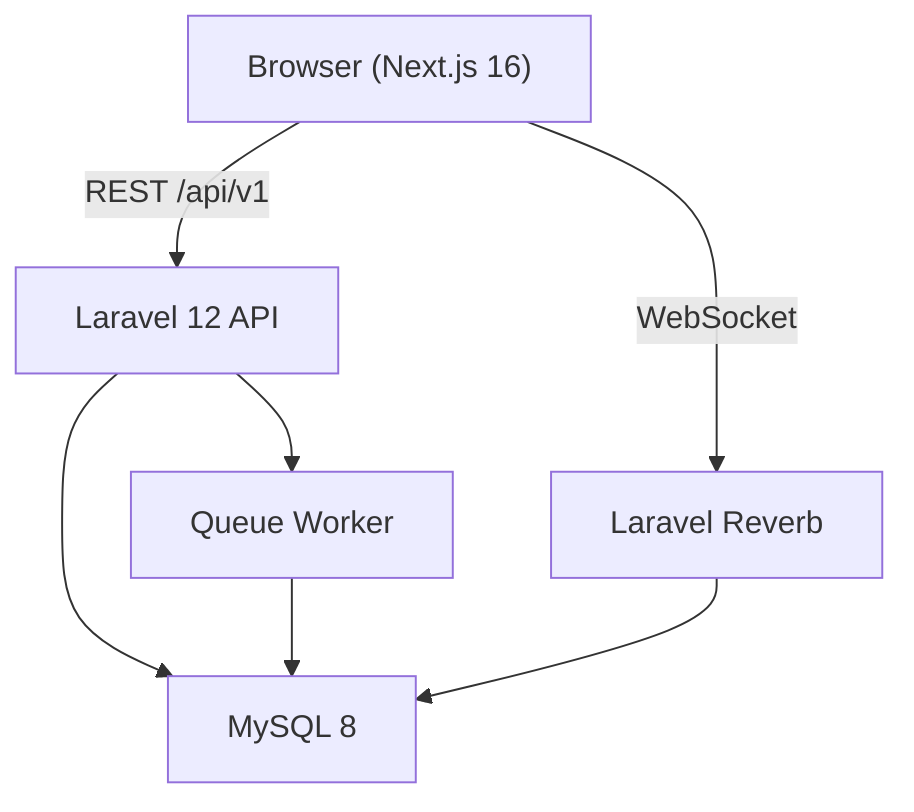

# Architecture

## Overview

MatriConnect is a full-stack matrimonial platform demo with a Laravel API backend and Next.js frontend.

## Backend (`/backend`)

| Layer | Technology |
|-------|-----------|
| Framework | Laravel 12, PHP 8.2+ |
| Auth | Laravel Sanctum (SPA tokens) |
| Database | MySQL 8 |
| Real-time | Laravel Reverb + Laravel Echo |
| Search | Laravel Scout (database driver) |
| Queue | Database driver |
| Payments | SSLCommerz (bypassed in `DEMO_MODE`) |
| Calls | WebRTC signaling + optional TURN server |
| Face scan | MediaPipe (browser-side) |
| Admin | Laravel Blade super-admin + Next.js admin panel |

### Key directories

- `app/Http/Controllers/Api/V1/` — REST API controllers
- `app/Services/` — Business logic (matching, subscriptions, chat, etc.)
- `database/migrations/` — 57 migrations
- `database/seeders/` — Demo data (30 users, plans, CMS pages)
- `routes/api.php` — API route definitions

## Frontend (`/frontend`)

| Layer | Technology |
|-------|-----------|
| Framework | Next.js 16 (App Router), React 19 |
| Styling | Tailwind CSS 4, shadcn/ui |
| State | Zustand + TanStack Query |
| Forms | React Hook Form + Zod |
| Real-time | Laravel Echo + Pusher JS |

### Route groups

- `(public)/` — Marketing pages, search, CMS
- `(auth)/` — Login, register, password reset
- `(dashboard)/` — Authenticated user features
- `admin/` — Next.js admin panel

## Core Features

1. **Profiles** — Multi-section matrimony profiles (religious, family, career, horoscope, preferences)
2. **Matching** — Compatibility scoring + daily match digest
3. **Search** — Public and authenticated search with filters
4. **Social** — Interests, shortlist, block, report, profile views
5. **Chat** — Real-time messaging with typing indicators
6. **Calls** — WebRTC audio/video (requires TURN server for production)
7. **Subscriptions** — Free/Gold tiers with feature gating
8. **Admin** — User management, photo moderation, reports

## Demo Limitations

| Feature | Demo behavior |
|---------|--------------|
| Payments | `DEMO_MODE=true` activates plans instantly |
| Photos | SVG placeholder avatars (no Cloudflare Images) |
| WebRTC calls | UI present; needs TURN server for real calls |
| Email | Logged to `storage/logs` (no SMTP) |
| Face scan | Works in browser via MediaPipe WASM |

## Production Reference

This demo is a sanitized recreation of a production matrimonial platform built for [My Bouma](https://mybouma.com/). The production site uses Cloudflare R2/Images, SSLCommerz payments, and a self-hosted TURN server.
